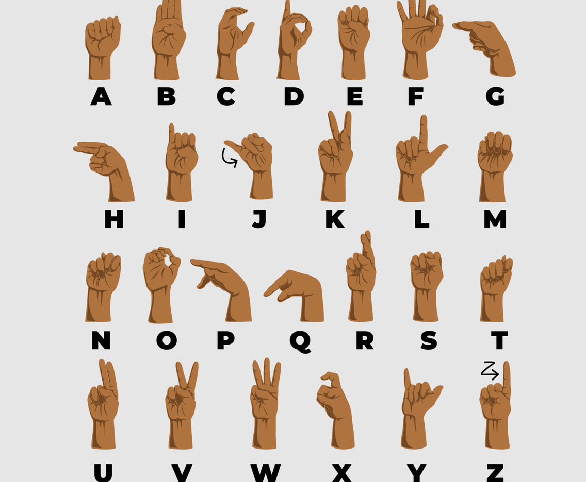

# SignLanguage_Conversion_text_speech

A deep learning-based project that converts sign language gestures into **text** and **speech**, enabling real-time communication between sign language users and non-signers.

---

## Project Overview

This project leverages computer vision and deep learning to recognize sign language gestures from a webcam feed. Once a gesture is identified, it is converted into corresponding **text**, and then into **speech** using Python’s `pyttsx3` library.  

The goal is to simulate a real-life dialogue between sign language users and non-signers, providing an accessible communication bridge.

---

## Features

- **Real-Time Gesture Recognition**: Uses your webcam to detect hand gestures.
- **Text Translation**: Recognized gestures are translated into readable text.
- **Text-to-Speech Output**: The translated text is converted into speech with `pyttsx3`.
- **Supports Common Sign Language Alphabets**: Trained on a dataset of basic hand gestures.

---

## Gesture Classification

### Convolutional Neural Network (CNN)

The core of gesture recognition uses a **Convolutional Neural Network (CNN)**, a type of neural network designed for computer vision tasks. Inspired by the visual cortex of the human brain, CNNs detect patterns in images through **filters/kernels** and assign weights to detect specific features.

Unlike regular neural networks, CNN neurons are arranged in **3 dimensions**: width, height, and depth. Neurons in a layer are connected only to a local region of the previous layer instead of all neurons, allowing the network to focus on spatial hierarchies of features.

The CNN architecture includes the following layers:

#### Convolutional Layer
- Uses a small window/filter (typically 5×5) that slides over the input image with a stride (usually 1).
- Computes a dot product between filter and input values to produce a 2D **activation map**, showing the presence of specific features (edges, colors, textures).

#### Pooling Layer
- Reduces the size of the activation map, lowering computational cost.
- **Max Pooling**: Selects the maximum value in a window (e.g., 2×2).
- **Average Pooling**: Computes the average of values in a window.

#### Fully Connected Layer
- Neurons are connected to all inputs, combining learned features for final classification.
- Outputs a vector corresponding to the number of classes.

---

### Gesture Classes and Accuracy

- The model was trained on **180 images per alphabet**.
- Due to lower initial accuracy on all 26 alphabets, the letters were grouped into **8 classes of similar-looking alphabets**:
  1. [y, j]  
  2. [c, o]  
  3. [g, h]  
  4. [b, d, f, i, u, v, k, r, w]  
  5. [p, q, z]  
  6. [a, e, m, n, s, t]  
- Each gesture is assigned a probability; the highest probability determines the predicted label.
- Further classification within a group is performed using **mathematical operations on hand landmarks**.
- Achieved **97% accuracy** overall, reaching **99%** under clean background and good lighting conditions.

---

## Text-to-Speech Translation

The recognized gestures are converted to text, which is then spoken aloud using the `pyttsx3` library. This simple yet effective feature allows users to simulate real-life conversations with non-signers.  

---

## Requirements

### Hardware

- Webcam (built-in or USB)

### Software

- **Programming Language**: Python 3.9+
- **Python Libraries**:
  - `OpenCV`
  - `NumPy`
  - `Keras`
  - `TensorFlow`
  - `MediaPipe`
  - `pyttsx3`